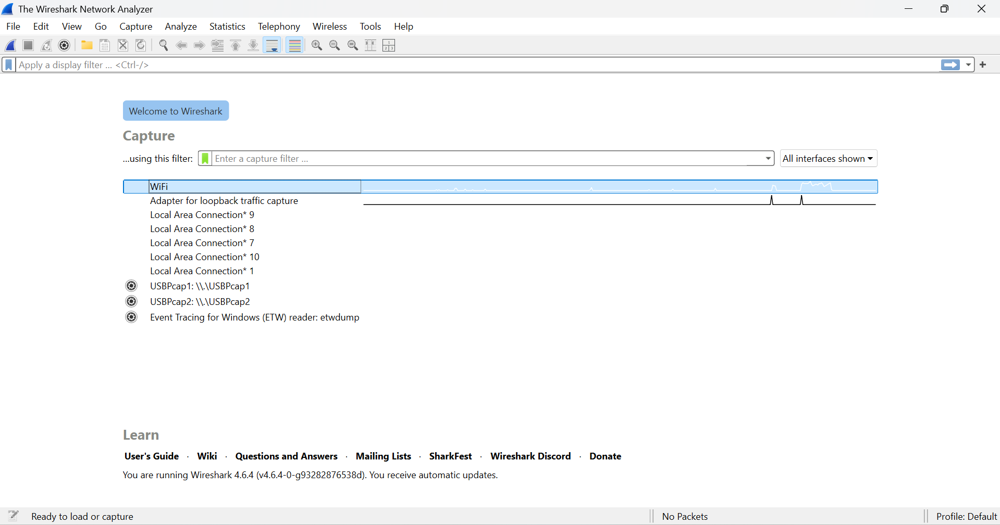
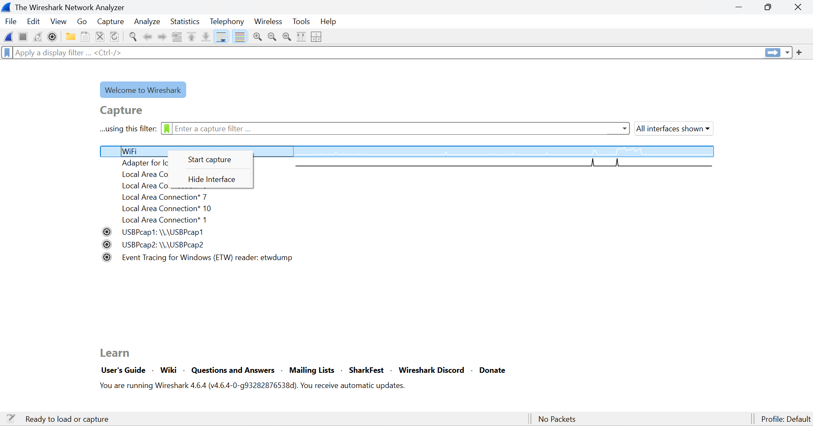
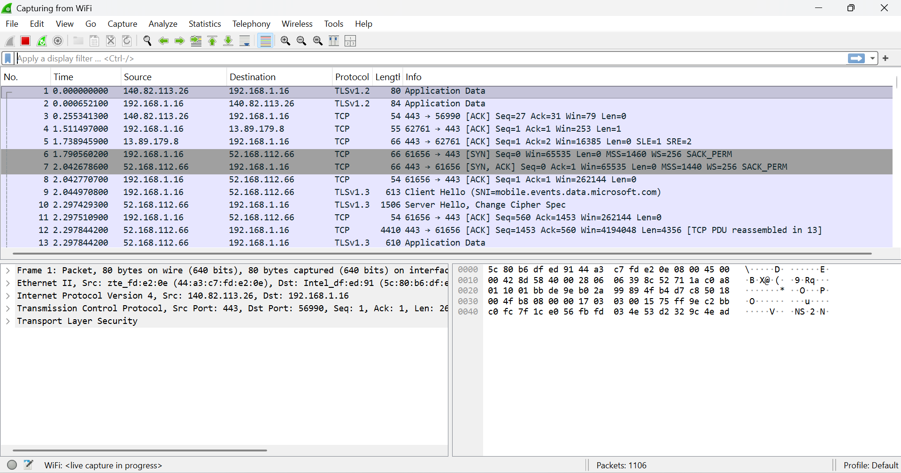
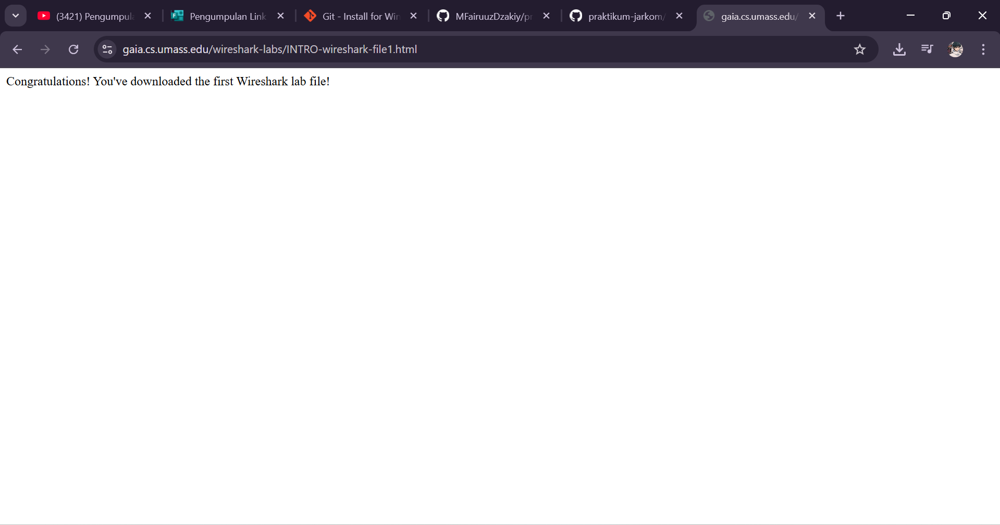
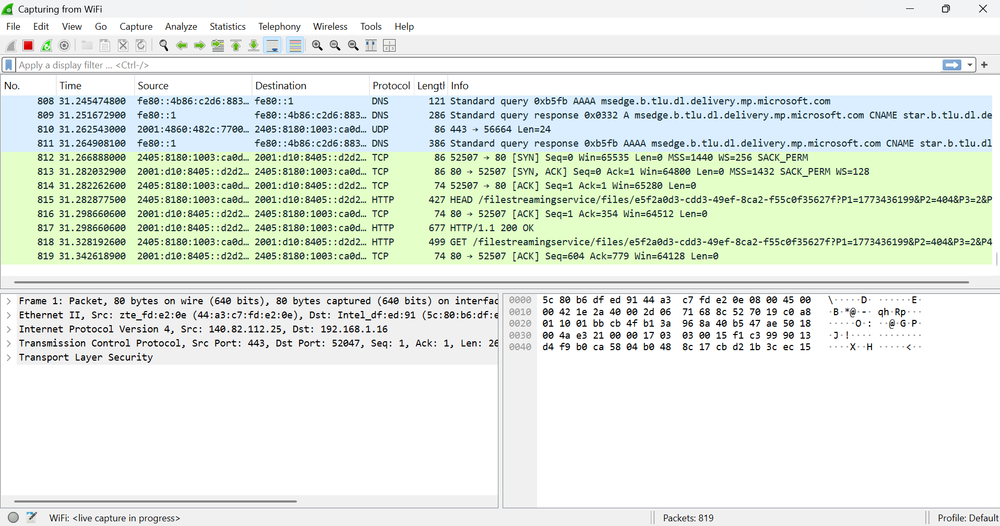
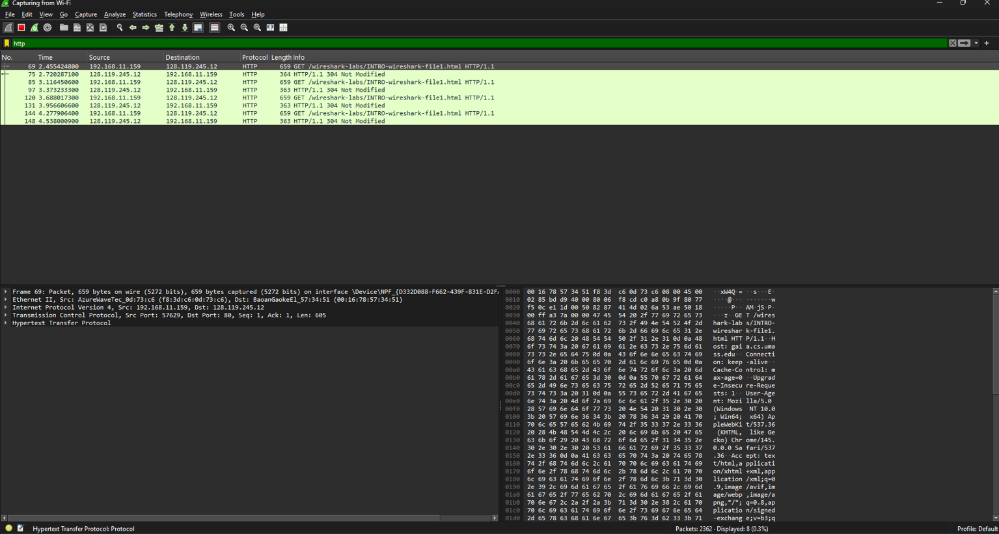

#Laporan Praktikum Jarkom IF

#Langkah-langkah 

1.Membuka aplikasi Wireshark
Langkah pertama yang dilakukan adalah membuka aplikasi Wireshark dan juga browser. Setelah itu, pilih jaringan Wi-Fi yang sedang digunakan. Kemudian klik kanan pada jaringan tersebut dan pilih Start Capture agar Wireshark mulai menangkap paket data yang lewat di jaringan.

2.Proses capture paket jaringan
Setelah proses capture dimulai, Wireshark akan menampilkan banyak sekali paket jaringan yang masuk dan keluar dari komputer. Tapi pada tahap ini masih belum terlihat secara jelas paket mana yang berasal dari aktivitas yang kita lakukan di browser.

3.Membuat aktivitas jaringan melalui browser
Agar muncul aktivitas jaringan yang bisa dianalisis, kita membuka link yang sudah disediakan melalui browser, yaitu:
http://gaia.cs.umass.edu/wireshark-labs/INTRO-wireshark-file1.html
Dengan membuka halaman tersebut, Wireshark akan merekam paket-paket jaringan yang muncul dari proses mengakses website tersebut..

4.Menghentikan proses capture
Setelah halaman website berhasil dibuka, proses capture pada Wireshark kemudian dihentikan. Tujuannya supaya kita bisa melihat daftar paket jaringan yang sudah direkam selama proses membuka website tadi.

5.Memfilter paket jaringan
Langkah terakhir adalah melakukan penyaringan paket agar lebih mudah dianalisis. Caranya dengan mengetikkan “http” pada kolom filter di Wireshark. Setelah itu akan muncul paket-paket yang menggunakan protokol HTTP, termasuk paket yang berasal dari website yang sebelumnya kita akses.

#Lampiran
Hasilnya :

 
 